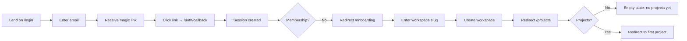
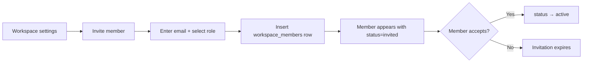
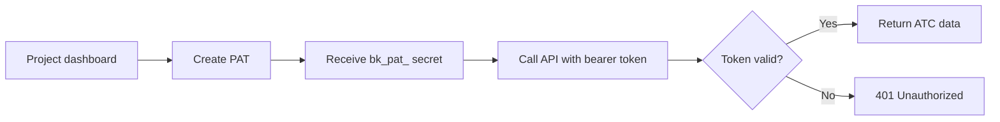
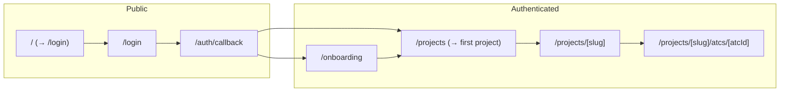

# User Journeys — Bunkai TMS

> Generated: 2026-05-25

## Route Map

### Public Routes (Unauthenticated)

| Route | Page | Purpose |
|-------|------|---------|
| `/` | HomePage | Redirects to `/login` |
| `/login` | LoginPage | Magic-link sign-in form + brand panel |
| `/auth/callback` | Route Handler | OTP exchange (code → session) |

### Protected Routes (Authenticated)

| Route | Page | Requires (role) | Purpose |
|-------|------|-----------------|---------|
| `/onboarding` | OnboardingPage | Any authenticated user | Create first workspace |
| `/projects` | ProjectsIndexPage | Active workspace member | Route to first project or show empty state |
| `/projects/[projectSlug]` | ProjectPage | Active workspace member (any role) | ATC dashboard with sidebar, table, toolbar |
| `/projects/[projectSlug]/atcs/[atcId]` | ATC detail page | Active workspace member (any role) | ATC editor + anchoring panel |

### API Routes

| Route | Method | Purpose | Auth |
|-------|--------|---------|------|
| `/api/v1/health` | GET | Health check | None |
| `/api/v1/auth/magic-link` | POST | Send OTP email | None |
| `/api/v1/tokens` | GET | List PATs | Session |
| `/api/v1/tokens` | POST | Create PAT | Session |
| `/api/v1/tokens/[id]` | DELETE | Revoke PAT | Session |
| `/api/openapi` | GET | Serve OpenAPI spec | None |
| `/api/openapi/docs` | GET | Scalar docs UI | None |

Found in: `app/` directory tree, `middleware.ts` (route protection matcher).

## Journey 1: First-time User Onboarding

### Persona + Goal
**Persona:** QA Engineer / Developer
**Goal:** Create a workspace and access the ATC dashboard for the first time.

### Discovered From
`/login` page → `/auth/callback` → `/onboarding` → `/projects` → `/projects/[slug]`

### Flow Diagram


### Step-by-Step Flow

| Step | Page | Action | Next | Evidence |
|------|------|--------|------|----------|
| 1 | `/login` | User enters email, submits magic-link form | Email sent | `magic-link-form.tsx` |
| 2 | Email | User clicks magic link in email | Callback | - |
| 3 | `/auth/callback` | OTP code exchanged for session | Redirect to `/onboarding` or `/projects` | `callback/route.ts` |
| 4 | `/onboarding` | User enters workspace slug + name | Create workspace | `onboarding-form.tsx` + `bunkai_bootstrap_workspace()` RPC |
| 5 | `/projects` | System checks for existing projects | Redirect to first project or show empty state | `projects/page.tsx` |
| 6 | `/projects/[slug]` | ATC dashboard displayed | User can now navigate | `projects/[slug]/page.tsx` |

### Error Paths

| Error | Handling | Evidence |
|-------|----------|----------|
| Invalid/expired magic link | Supabase returns error, callback redirects to `/login?error=...` | `callback/route.ts` |
| Workspace slug taken | DB UNIQUE constraint, `bunkai_bootstrap_workspace` raises 23505 | `0006_bootstrap_workspace.sql` |
| Invalid slug format | RPC raises `invalid_slug` (SQLSTATE 22023) | `0006_bootstrap_workspace.sql` |

### Success Criteria
- [x] User receives magic link email
- [x] Session is created after clicking link
- [x] Workspace is created with owner membership
- [x] User lands on the ATC dashboard

## Journey 2: ATC Authoring

### Persona + Goal
**Persona:** QA Engineer
**Goal:** Create a new ATC linked to an acceptance criterion.

### Discovered From
Project page → sidebar module → "New ATC" button → editor → anchor to AC → save

### Flow Diagram
```mermaid
flowchart LR
  A[Project dashboard] --> B[Click \"New ATC\"]
  B --> C[ATC Editor opens]
  C --> D[Enter title, layer, tags]
  D --> E[Write steps]
  E --> F[Write assertions]
  F --> G[Anchor to acceptance criteria]
  G --> H[Save ATC]
  H --> I{Success?}
  I -->|Yes| J[ATC appears in table]
  I -->|No| K[Show validation errors]
```

### Step-by-Step Flow

| Step | Page | Action | Next | Evidence |
|------|------|--------|------|----------|
| 1 | `/projects/[slug]` | User clicks "New ATC" button | ATC editor | `projects/[slug]/page.tsx` shows Button with `Plus` icon + "New ATC" |
| 2 | ATC Editor | User fills title, selects layer (UI/API/Unit), adds tags | Steps editor | `AtcEditor.tsx` |
| 3 | Step Editor | User writes numbered steps with optional `input:` and `expected:` | Assertions editor | `StepEditor.tsx`, `atc-parse.ts` (markdown parser) |
| 4 | Assertion Editor | User writes bullet-point assertions | Anchoring panel | `assertionsToYaml()` in `atc-parse.ts` |
| 5 | Anchoring Panel | User selects acceptance criteria to link | Save | `AnchoringPanel.tsx` |
| 6 | Save | `bunkai_save_atc()` RPC called | ATC table updates | `actions.ts` (server actions) + `0007_save_atc.sql` |

### Error Paths

| Error | Handling | Evidence |
|-------|----------|----------|
| No AC selected | Application-layer validation: `p_ac_ids` must be non-empty | `0007_save_atc.sql` |
| Empty step content | Step saved with empty string content | `atc-parse.ts` (allows empty) |
| Invalid layer value | DB CHECK constraint rejects it | `0004_atcs.sql` |

### Success Criteria
- [x] ATC appears in the ATC table
- [x] Steps and assertions are saved in order
- [x] ATC-AC link is created in `atc_acceptance_criteria`
- [x] ATC version is incremented

## Journey 3: Team Management (Admin)

### Persona + Goal
**Persona:** QA Lead / Test Manager
**Goal:** Add a new team member to the workspace with appropriate permissions.

### Discovered From
Admin RLS policies, workspace member management logic.

### Flow Diagram (Inferred — no dedicated UI yet)


### Step-by-Step Flow (API-level)

| Step | Action | Next | Evidence |
|------|--------|------|----------|
| 1 | Admin inserts row into `workspace_members` with role=viewer/member and status=invited | Member receives invitation | `0001_tenancy.sql` + RLS: `workspace_members_insert_admin` |
| 2 | Invited user logs in | System checks membership | `middleware.ts` |
| 3 | User accepts | status changes to active | — |

### Error Paths

| Error | Handling | Evidence |
|-------|----------|----------|
| Non-admin tries to invite | RLS blocks INSERT → 403 | `0005_rls_helpers.sql` |
| Already a member | UNIQUE constraint on (workspace_id, user_id)? Not enforced at DB — app layer | `0001_tenancy.sql` (no explicit unique on pair) |

### Success Criteria
- [x] New member row created in `workspace_members`
- [x] Non-admin users cannot invite

## Journey 4: API Integration (Automation)

### Persona + Goal
**Persona:** QA Automation Engineer
**Goal:** Create a PAT and use it to fetch ATCs via the API.

### Flow Diagram


### Step-by-Step Flow

| Step | Action | Evidence |
|------|--------|----------|
| 1 | User POSTs to `/api/v1/tokens` (session-authenticated) | `api/v1/tokens/route.ts` |
| 2 | Server issues PAT: `bk_pat_<prefix>.<secret>`, stores SHA-256 hash | `0008_access_tokens.sql` |
| 3 | CLI/agent calls API with `Authorization: Bearer bk_pat_<prefix>.<secret>` | `lib/api/middleware/bearer.ts` |
| 4 | Server looks up token by prefix, constant-time compares hash | `0008_access_tokens.sql` (comment on token_prefix) |
| 5 | If valid and not expired/revoked → serve request | Middleware logic |

### Error Paths

| Error | Handling | Evidence |
|-------|----------|----------|
| Invalid token prefix | 401 — prefix not found | Middleware |
| Revoked token | 401 — `revoked_at IS NOT NULL` | `0008_access_tokens.sql` |
| Expired token | 401 — `expires_at < now()` | `0008_access_tokens.sql` |
| Insufficient scopes | 403 — scope check | Middleware |

### Success Criteria
- [x] PAT is created with SHA-256 stored, raw secret returned once
- [x] Bearer token is validated on each API call
- [x] Revoked token is immediately rejected

## Navigation Structure



## Breadcrumb Patterns

| Path | Breadcrumb |
|------|------------|
| `/projects/[slug]` | `Workspace Name · Project Name · All ATCs` |
| `/projects/[slug]/atcs/[id]` | `Workspace Name · Project Name · ATC Title` |

Found in: `projects/[slug]/page.tsx` — `Breadcrumb items={[workspace.name, project.name, 'All ATCs']}`

## Critical Paths

### Happy Paths (Must Work)

| Journey | Start | End | Business Impact |
|---------|-------|-----|-----------------|
| User sign-up via magic link | `/login` | `/projects/[slug]` | User acquisition |
| ATC creation | Dashboard | Saved ATC | Core value proposition |
| Module tree browsing | Dashboard | Any ATC detail | Navigation |
| PAT creation + API call | Dashboard | API response | Automation use case |

### Unhappy Paths (Must Handle)

| Scenario | Expected Behavior | Evidence |
|----------|------------------|----------|
| Expired magic link | Show error, allow re-send | Callback route |
| Invalid workspace slug | Show validation error | `0006_bootstrap_workspace.sql` |
| No email configured | Auth flow completely blocked | `env.ts` requires Supabase keys |
| Expired PAT | 401, clear error message | Middleware |
| Unauthenticated access to protected route | Redirect to `/login?next=...` | `middleware.ts` |

## Discovery Gaps

| Flow | Unknown | Question |
|------|---------|----------|
| Email delivery | How does the magic link email look? | Email template content |
| Workspace invitation | How does a user accept an invitation? | No dedicated accept flow in code |
| Multi-workspace switching | UI for switching workspaces | Phase E feature |
| Test execution runner | How are ATCs executed? | No runner exists yet |

## QA Relevance

### Critical E2E Test Scenarios

| Priority | Scenario | Journey Reference |
|----------|----------|------------------|
| P0 | Magic-link login → onboarding → project dashboard | Journey 1 |
| P0 | Create ATC with steps + assertions + AC links | Journey 2 |
| P0 | RBAC: viewer cannot edit ATC | Journey 2 (error path) |
| P0 | PAT create → validate → revoke → reject | Journey 4 |
| P1 | Module tree navigation sidebar | Journey 2 |
| P1 | ATC search/filter | Journey 2 |
| P1 | API health check | Journey 4 |

### Suggested Test Data

| Journey | Test User | Prerequisites |
|---------|-----------|---------------|
| Onboarding | New user (no workspace) | Fresh Supabase auth account |
| ATC Authoring | `member` in a workspace | Existing workspace + project + module + user story + AC |
| Team Management | `admin` in a workspace | Existing workspace with >1 user |
| API Integration | Any active user | Existing PAT |
