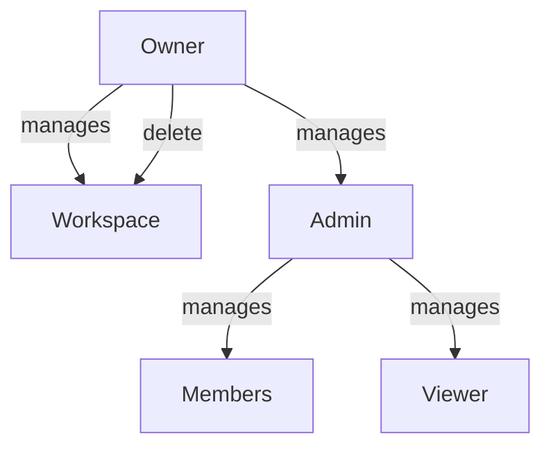

# User Personas — Bunkai TMS

> Generated: 2026-05-25

## Persona Discovery Summary

| Persona | System Role | Access Level | Primary Goal |
|---------|-------------|-------------|--------------|
| QA Engineer | member | Read + Write ATCs | Author structured, traceable test cases for sprint stories |
| QA Automation Engineer | member | Read + Write ATCs + API | Consume test specs programmatically, integrate with automation frameworks |
| QA Lead / Test Manager | admin/owner | Full control | Oversee coverage, manage team, configure workspace |
| Developer | viewer/member | Read/View ATCs | Understand test coverage for owned stories |

## Persona 1: QA Engineer

### Identity
- **System Role:** `member` (default; `admin` if also managing the workspace)
- **Evidence:** ATC editor components (`AtcEditor`, `StepEditor`, `AnchoringPanel`), module tree sidebar
- **Access Level:** Read + Write ATCs, user stories, acceptance criteria
- **Estimated % of Users:** 40%

### Goals (Inferred from Features)
| Goal | Supporting Feature | Route/Component |
|------|-------------------|-----------------|
| Create reusable test cases | ATC CRUD with steps + assertions | `projects/[slug]/page.tsx`, `AtcEditor.tsx` |
| Link tests to acceptance criteria | Anchoring panel | `AnchoringPanel.tsx` |
| Organize tests in hierarchy | Module tree sidebar | `Sidebar.tsx` |
| Search/filter tests | Full-text search (tsvector) | `AtcTable.tsx` |
| Update test status | ATC status management | `atcs.status` field |

### Pain Points (Inferred from Code)
| Pain Point | Evidence |
|------------|----------|
| No quick way to see which ACs lack test coverage | No dashboard or coverage metric UI |
| Manual status updates | No execution engine integration |
| Cannot easily clone/reuse ATCs across stories | No duplicate/clone ATC feature |

### Feature Access
| Feature | Access | Evidence |
|---------|--------|----------|
| View ATCs | Full | Sidebar + AtcTable |
| Create/Edit ATCs | Full | AtcEditor, AnchoringPanel |
| Manage modules | Full | Module tree (server-driven) |
| Manage workspace members | None | Admin-only per RLS |
| Delete workspace | None | Owner-only per RLS |
| Manage PATs | Own only | `access_tokens_update_own` policy |

### User Journey Summary (QA Engineer)
```
Login → Workspace → Project → (Select Module / View ATCs → Create ATC → Link ACs → Save)
```

### Profile Attributes
From `auth.users` schema: `id, email, created_at, last_sign_in_at`. From `workspace_members`: `role, status`.

### Representative Quote (Inferred)
> "I need to prove every acceptance criterion has a corresponding test case, and I need my test steps to be structured enough that someone else can run them."

## Persona 2: QA Automation Engineer

### Identity
- **System Role:** `member`
- **Evidence:** PAT bearer auth middleware (`lib/api/middleware/bearer.ts`), OpenAPI spec (`api/openapi/`), PAT creation UI (token management)
- **Access Level:** Read + Write ATCs via API, execute test runs
- **Estimated % of Users:** 25%

### Goals (Inferred from Features)
| Goal | Supporting Feature | Route/Component |
|------|-------------------|-----------------|
| Fetch ATCs programmatically | API via PAT auth | `api/v1/tokens/route.ts` |
| Push test results back | ATC status update API | `atcs` status field |
| Integrate with CI pipeline | PAT auth for non-interactive auth | `access_tokens` table |

### Pain Points (Inferred from Code)
| Pain Point | Evidence |
|------------|----------|
| No test execution runner | ATCs can be authored but not executed automatically |
| No webhook for test results | No event/callback mechanism |

### Feature Access
Same as QA Engineer, plus:
| Feature | Access | Evidence |
|---------|--------|----------|
| PAT create/list/revoke | Own tokens | `access_tokens` RLS policies |
| API access | Via bearer token | `lib/api/middleware/bearer.ts` |
| Execute test runs | Future | `run:execute` scope exists |

### Representative Quote (Inferred)
> "I want my Playwright test runner to pull ATCs from Bunkai's API, execute them, and push pass/fail status back — all without a browser session."

## Persona 3: QA Lead / Test Manager

### Identity
- **System Role:** `admin` or `owner`
- **Evidence:** Admin RLS policies (`bunkai_is_workspace_admin`, `bunkai_is_workspace_owner`), workspace member management policies
- **Access Level:** Full control over workspace, members, and projects
- **Estimated % of Users:** 15%

### Goals (Inferred from Features)
| Goal | Supporting Feature | Route/Component |
|------|-------------------|-----------------|
| Manage team access | Member invite/role/status management | `workspace_members` table |
| Oversee test coverage | ATC aggregation across modules | Module tree + ATC counts |
| Configure workspace settings | Workspace update | `workspaces` table (owner-only update) |

### Pain Points (Inferred from Code)
| Pain Point | Evidence |
|------------|----------|
| No dashboard/cross-project reports | No aggregate metrics UI |
| Cannot see ATC coverage per AC | No coverage visualization |

### Representative Quote (Inferred)
> "I need to know which stories in this sprint have full test coverage and which have gaps — at a glance."

## Persona 4: Developer

### Identity
- **System Role:** `viewer` or `member`
- **Evidence:** RLS `SELECT` policies allow any active member to read; sidebar/ATC-table read behavior doesn't require specific roles
- **Access Level:** Read ATCs, view test coverage for stories
- **Estimated % of Users:** 20%

### Goals (Inferred from Features)
| Goal | Supporting Feature | Route/Component |
|------|-------------------|-----------------|
| See test coverage for my story | Sidebar explorer with ATCs per story | `Sidebar.tsx` |
| Understand acceptance criteria | AC display in module tree | Sidebar AC nesting |

### Representative Quote (Inferred)
> "I just want to see which acceptance criteria have tests so I know whether my PR is ready for QA."

## Role Hierarchy



## Permission Matrix

| Operation | Viewer | Member | Admin | Owner |
|-----------|--------|--------|-------|-------|
| View ATCs | ✅ | ✅ | ✅ | ✅ |
| View workspace members | — | — | ✅ | ✅ |
| Create/Edit ATCs | — | ✅ | ✅ | ✅ |
| Create/Edit modules | — | ✅ | ✅ | ✅ |
| Create/Edit projects | — | ✅ | ✅ | ✅ |
| Manage workspace members | — | — | ✅ | ✅ |
| Update workspace settings | — | — | — | ✅ |
| Delete workspace | — | — | — | ✅ |
| Create PATs | — | ✅ (own) | ✅ (own) | ✅ (own) |

Found in: `0005_rls_helpers.sql` — `bunkai_is_workspace_member`, `bunkai_can_write_workspace`, `bunkai_is_workspace_admin`, `bunkai_is_workspace_owner`.

## Discovery Gaps

| Gap | Why It Matters | Question to Ask |
|-----|---------------|-----------------|
| No personas identified beyond system roles | Cannot design targeted features | Are there distinct user segments (freelance QA vs enterprise)? |
| No demographic data | Cannot estimate user distribution | What's the typical team size per workspace? |
| No onboarding funnel data | Cannot validate persona assumptions | How do users discover Bunkai? |

## QA Relevance

### Test Account Requirements
| Persona | Test Account | Permissions Needed |
|---------|-------------|-------------------|
| Viewer | `test-viewer@example.com` | Active member in a workspace with role=viewer |
| Member | `test-member@example.com` | Active member with role=member |
| Admin | `test-admin@example.com` | Active member with role=admin |
| Owner | `test-owner@example.com` | Workspace owner |

### Critical Persona Flows to Test
| Flow | Persona | Priority |
|------|---------|----------|
| Login → Create workspace → Create project → Create ATC | QA Engineer | P0 |
| PAT create → API call → validate token | Automation Engineer | P0 |
| Invite member → change role → verify permissions | Test Manager | P1 |
| Viewer tries to edit ATC → rejected | Developer | P1 |

### Edge Cases by Persona
| Edge Case | Persona | Expected Behavior |
|-----------|---------|-------------------|
| Member tries to delete workspace | QA Engineer | 403 Forbidden |
| Viewer tries to create ATC | Developer | 403 Forbidden (via RLS) |
| Expired PAT used for API | Automation Engineer | 401 Unauthorized |
| Revoked PAT used for API | Automation Engineer | 401 Unauthorized |
