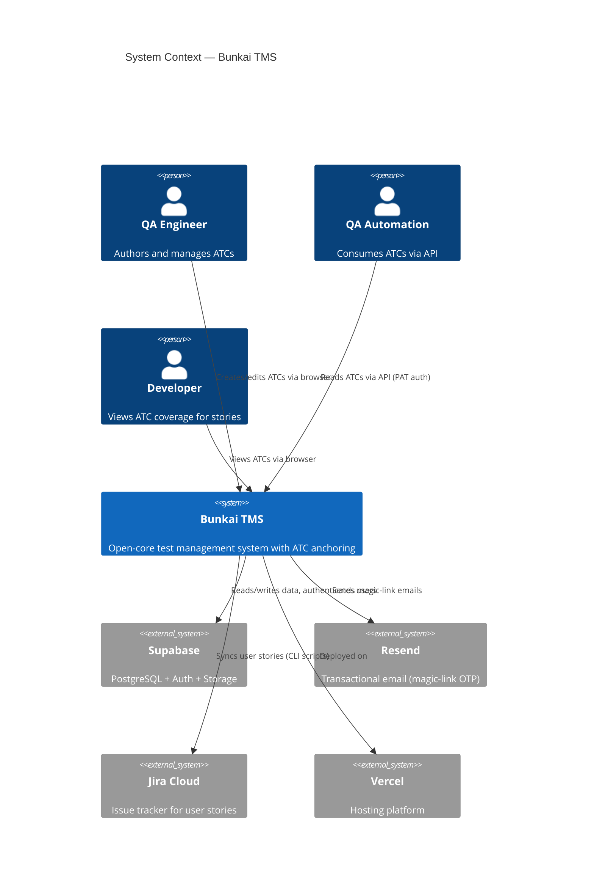
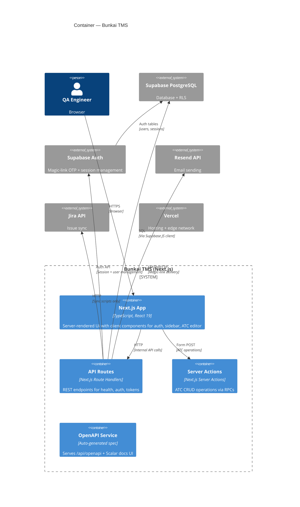
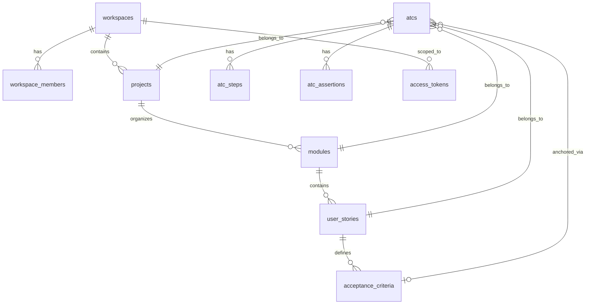
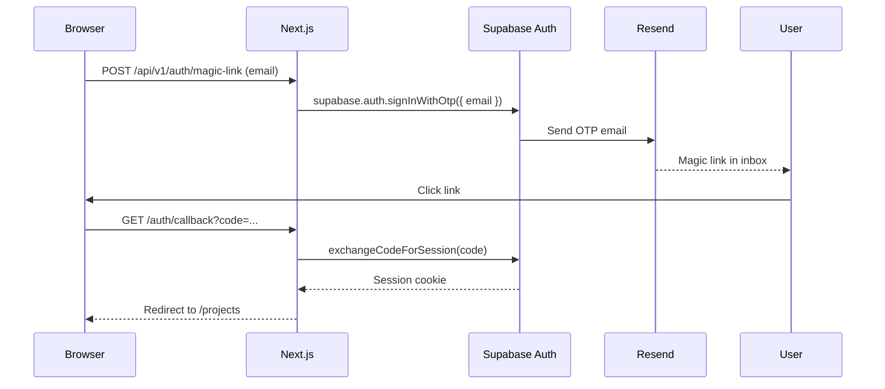
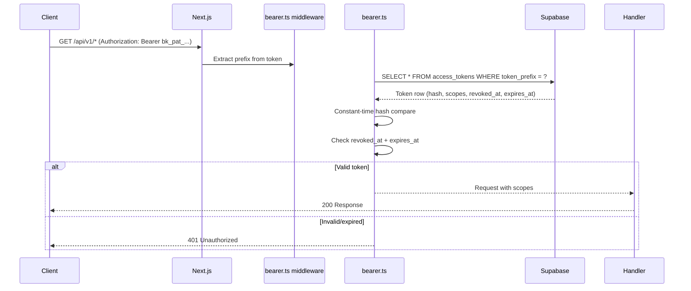

# Architecture — Bunkai TMS

> Generated: 2026-05-25

## System Overview

| Aspect | Value |
|--------|-------|
| Pattern | Next.js App Router (SSR) + Supabase BaaS |
| Frontend | Next.js 15.5 (React 19) + Tailwind CSS + shadcn/ui |
| Backend | Next.js Route Handlers (serverless) |
| Database | Supabase PostgreSQL (via Supabase JS client) |
| Auth | Supabase Auth (magic-link OTP) + PAT bearer tokens |
| API | REST (auto-generated OpenAPI spec) |
| Validation | Zod 4 |
| Hosting | Vercel |

## C4 Context Diagram



## C4 Container Diagram



## Component Structure

### Directory Layout

```
app/
├── (app)/                  # Authenticated route group (with AuthProvider)
│   ├── layout.tsx           # AuthProvider wrapper
│   ├── projects/
│   │   ├── page.tsx         # Project routing logic
│   │   └── [projectSlug]/
│   │       ├── page.tsx     # Project dashboard (ATC table + sidebar)
│   │       └── atcs/[atcId]/
│   │           ├── page.tsx # ATC detail/editor
│   │           └── actions.ts # Server actions for ATC CRUD
│   └── onboarding/
│       ├── page.tsx         # First-workspace creation
│       └── onboarding-form.tsx # Slug input form
├── (auth)/                  # Public auth route group
│   └── login/
│       ├── page.tsx         # Login page
│       └── magic-link-form.tsx # Email submission form
├── auth/callback/route.ts   # OTP exchange
├── api/
│   ├── v1/                  # REST API v1
│   │   ├── health/          # GET /api/v1/health
│   │   ├── auth/magic-link/ # POST /api/v1/auth/magic-link
│   │   └── tokens/          # GET|POST /api/v1/tokens + DELETE [id]
│   └── openapi/             # Spec + Scalar docs
├── layout.tsx               # Root layout (fonts, theme, toaster)
└── globals.css              # Design tokens

lib/
├── api/                     # API middleware + error handling
│   ├── handler.ts           # withApiHandler wrapper
│   ├── error-envelope.ts    # ApiError + structured responses
│   ├── middleware/bearer.ts # PAT validation
│   ├── idempotency.ts       # Idempotency key support
│   ├── logging.ts           # JSON request logging
│   └── request-id.ts        # x-request-id propagation
├── supabase/                # Supabase client helpers
│   ├── client.ts            # Browser client
│   ├── server.ts            # Server client (cookie-based)
│   ├── admin.ts             # Service-role admin client
│   ├── rpc.ts               # Typed RPC wrappers
│   └── with-workspace.ts    # Workspace-scoped helpers
├── openapi/registry.ts      # Route annotation registry
├── types.ts                 # Entity type definitions
├── types/supabase.ts        # Generated DB types
├── atc-parse.ts             # ATC step/assertion parsers
├── tree.ts                  # Module tree builder
├── urls.ts                  # URL builders
├── env.ts                   # Server env validation (Zod)
└── utils.ts                 # cn() helper

components/
├── atcs/                    # ATC-specific components
│   ├── AnchoringPanel.tsx   # ATC↔AC linking UI
│   ├── AtcTable.tsx         # ATC data table
│   ├── AtcEditor.tsx        # ATC step/assertion editor
│   └── StepEditor.tsx       # Individual step editor
├── layout/                  # Layout components
│   ├── Sidebar.tsx           # Module tree sidebar
│   ├── Topbar.tsx            # Navigation bar + breadcrumbs
│   ├── WorkspaceSwitcher.tsx # Workspace/project picker
│   ├── Wordmark.tsx          # Brand wordmark
│   └── CommandPalette.tsx    # ⌘K command palette
├── providers/
│   └── auth-context.tsx      # AuthProvider (Supabase session)
└── ui/                      # shadcn/ui primitives
```

## Database Schema

### ER Diagram



### Table Detail

| Table | Columns | PK | FKs | Indexes |
|-------|---------|----|-----|---------|
| `workspaces` | id, slug (unique), name, owner_user_id, plan, created_at | id | owner_user_id → auth.users | slug (unique) |
| `workspace_members` | workspace_id, user_id, role, status, joined_at | (workspace_id, user_id) | workspace_id → workspaces, user_id → auth.users | — |
| `projects` | id, workspace_id, slug, name, description, created_at | id | workspace_id → workspaces | (workspace_id, slug) unique |
| `modules` | id, project_id, parent_module_id, path, name, position, created_at | id | project_id → projects, parent_module_id → modules | project_id, parent_module_id |
| `user_stories` | id, module_id, title, description, external_id, external_url, created_at | id | module_id → modules | module_id |
| `acceptance_criteria` | id, user_story_id, title, description, position, created_at | id | user_story_id → user_stories (CASCADE) | user_story_id, (user_story_id, position) unique |
| `atcs` | id, project_id, module_id, user_story_id, slug, title, layer, version, status, tags, tsv, created_at, updated_at | id | project_id, module_id → modules, user_story_id → user_stories (RESTRICT) | project_id, module_id, user_story_id, tsv (GIN), (project_id, slug) unique |
| `atc_steps` | id, atc_id, position, content, input_data, expected | id | atc_id → atcs (CASCADE) | atc_id, (atc_id, position) unique |
| `atc_assertions` | id, atc_id, position, content | id | atc_id → atcs (CASCADE) | atc_id, (atc_id, position) unique |
| `atc_acceptance_criteria` | atc_id, acceptance_criterion_id | (atc_id, acceptance_criterion_id) | atc_id → atcs (CASCADE), acceptance_criterion_id → acceptance_criteria (CASCADE) | acceptance_criterion_id |
| `access_tokens` | id, user_id, workspace_id, name, token_prefix, hash, scopes, expires_at, revoked_at, last_used_at, created_at | id | user_id → auth.users (CASCADE), workspace_id → workspaces (CASCADE) | token_prefix, (user_id, revoked_at) |

## Data Flow

### Request Flow (ATC Read)
```mermaid
sequenceDiagram
  Browser->>Next.js: GET /projects/[slug]
  Next.js->>Supabase: createServerClient(session cookie)
  Supabase-->>Next.js: User session
  Next.js->>Supabase: SELECT projects WHERE slug = ...
  Supabase-->>Next.js: Project data
  Next.js->>Supabase: SELECT modules, user_stories, atcs
  Supabase-->>Next.js: Full tree data
  Next.js->>buildModuleTree(): Build hierarchical tree
  Next.js-->>Browser: SSR response with ATC table + sidebar
```

### Auth Flow (Magic Link)


### PAT Auth Flow (API call)


## Security Architecture

### Authentication
| Mechanism | Implementation | Strength |
|-----------|---------------|----------|
| Magic-link OTP | Supabase Auth `signInWithOtp` | Passwordless, email-verified |
| Session cookies | `@supabase/ssr` `createServerClient` | HTTP-only, refreshed on each request |
| PAT bearer tokens | SHA-256 hash + constant-time compare | Token prefix lookup (O(1)) + hash verification |
| Service-role admin client | `SUPABASE_SERVICE_ROLE_KEY` | Bypasses RLS — server-only |

### Authorization
| Layer | Mechanism | Scope |
|-------|-----------|-------|
| Route protection | Next.js middleware checks `supabase.auth.getUser()` | `/projects/*`, `/onboarding` |
| Row-level security | PostgreSQL RLS policies per table | Workspace-scoped CRUD |
| Role-based access | `workspace_members.role`: viewer/member/admin/owner | Permission gating via SECURITY DEFINER helpers |
| PAT scopes | `access_tokens.scopes`: atc:read, atc:write, run:execute, workspace:admin | API-level permission |

### Data Protection
- No hardcoded secrets found in source code
- All Supabase clients use env vars (`NEXT_PUBLIC_SUPABASE_URL`, `SUPABASE_SERVICE_ROLE_KEY`)
- RLS policies prevent unauthorized cross-workspace data access
- PAT revocation via soft-delete (`revoked_at`) preserves audit trail
- Secret keys (`SUPABASE_SERVICE_ROLE_KEY`) validated as server-only via `import 'server-only'`

## External Services

| Service | Purpose | Integration Point | Auth |
|---------|---------|------------------|------|
| Supabase Auth | User authentication, session management | `@supabase/ssr` + `@supabase/supabase-js` | API keys + JWT |
| Supabase PostgreSQL | Primary database | Supabase JS client | Pooled connection via `DATABASE_URL` |
| Resend | Magic-link email delivery | Supabase Auth SMTP config | `RESEND_API_KEY` |
| Jira Cloud | Issue tracking sync | Custom scripts (`jira:sync-*`) | `ATLASSIAN_*` credentials |
| Vercel | Hosting + deployments | `next.config.ts` + platform config | Vercel dashboard |
| Monaco Editor | Code editor in ATC editor | `@monaco-editor/react` | Browser-side |

## Discovery Gaps

- [ ] Vercel vercel.json configuration — not in repo, likely configured at dashboard level
- [ ] CDN/caching configuration — no explicit caching headers in Next.js config
- [ ] Rate limiting — no rate limit middleware detected
- [ ] Email template for magic link — not in repo (managed by Supabase Auth)
- [ ] Backup strategy for PostgreSQL — unknown
- [ ] Monitoring/APM — none installed
- [ ] Webhook notifications — not implemented

## QA Relevance

### Components to Test
| Component | Test Approach | Priority |
|-----------|---------------|----------|
| Auth middleware | Unit test route protection logic | P0 |
| RLS policies | Integration test per-role access to each table | P0 |
| withApiHandler wrapper | Unit test error mapping, request-id, logging | P1 |
| ATC editor parsing | Unit test markdown/YAML parsers | P1 |
| Module tree builder | Unit test tree construction | P1 |

### Environment Requirements
| Need | Requirement |
|------|-------------|
| DB access | Supabase project with migration 0001-0008 applied |
| Auth | Supabase Auth enabled with magic-link provider |
| Email | Resend API key configured in Supabase Auth SMTP |
| Jira | Atlassian credentials for sync scripts (optional for core) |
