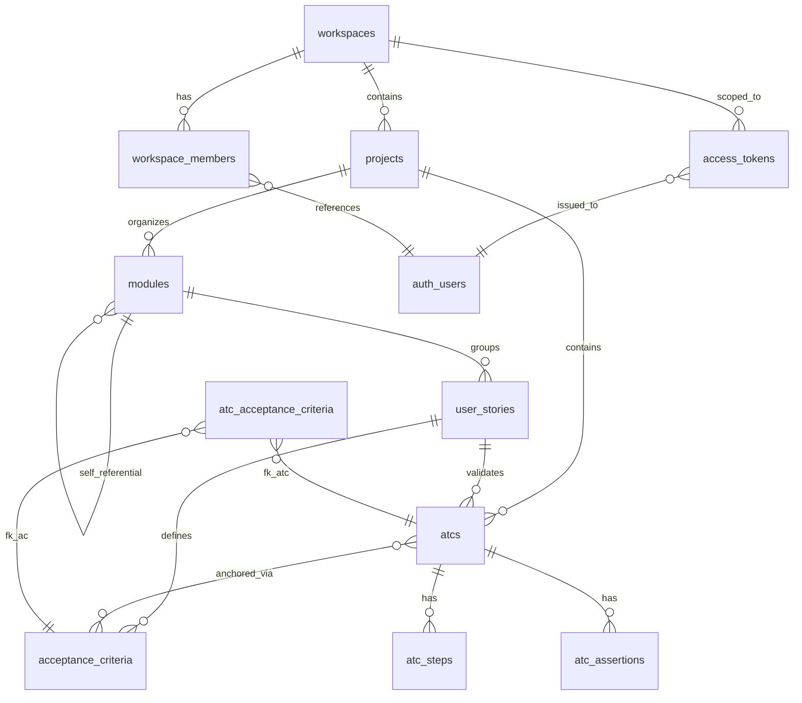
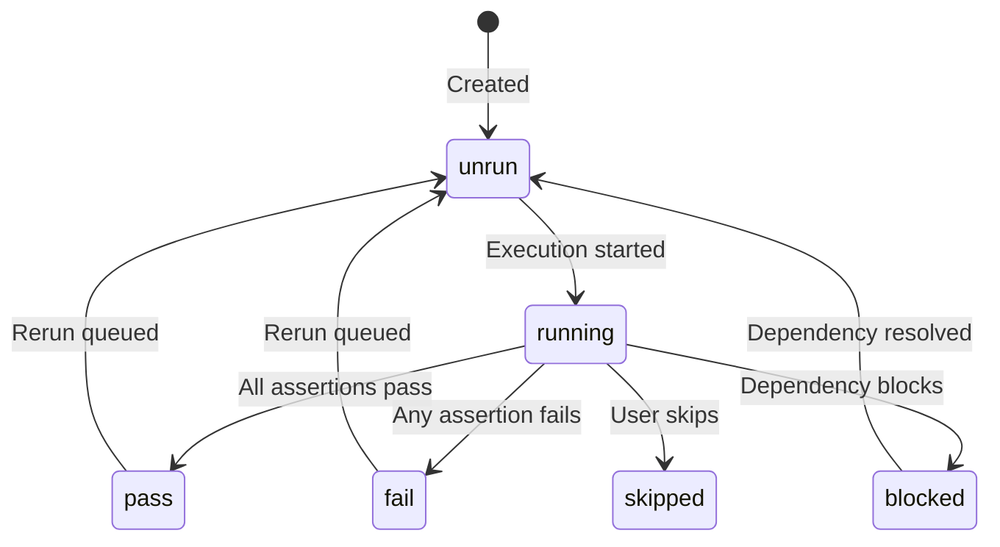
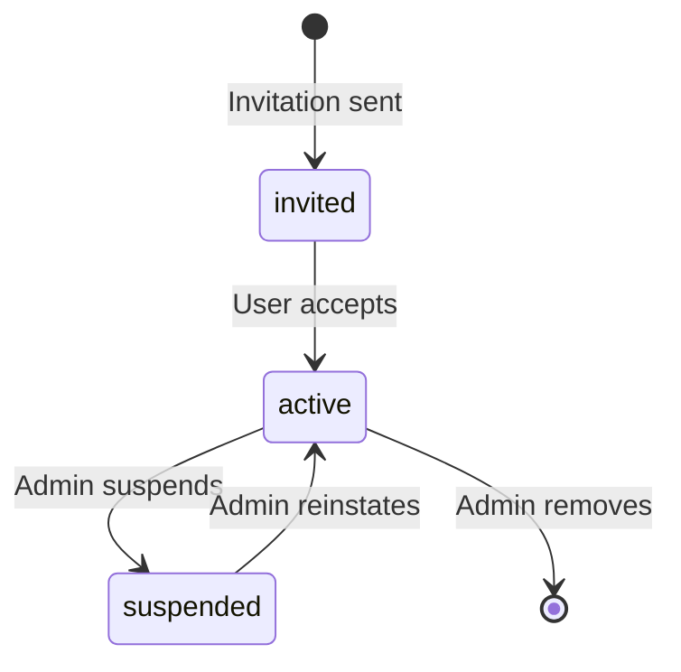
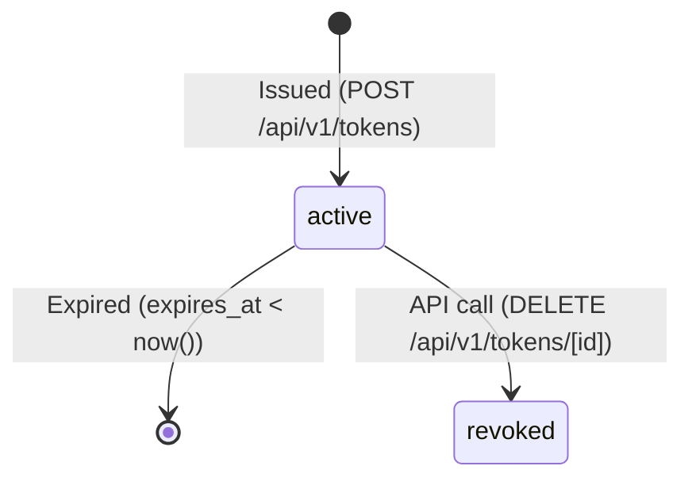

# Domain Glossary — Bunkai TMS

> Confidence: High (discovered from source code + DB schema)
> Generated: 2026-05-25

## Core Entities

### Workspace
| Technical Name | Business Name | Description | Table | Key Attributes | Found In |
|----------------|---------------|-------------|-------|----------------|----------|
| `workspaces` | Workspace | Multi-tenant boundary. Isolates users, projects, and data per organization/team. | `public.workspaces` | id, slug, name, owner_user_id, plan, created_at | `0001_tenancy.sql`, `lib/types.ts:16-23` |

**Relationships:** Has many `workspace_members`, has many `projects`.

**JSON example:**
```json
{
  "id": "550e8400-e29b-41d4-a716-446655440000",
  "slug": "my-org",
  "name": "My Organization",
  "owner_user_id": "660e8400-e29b-41d4-a716-446655440001",
  "plan": "community",
  "created_at": "2026-05-25T10:00:00Z"
}
```

### WorkspaceMember
| Technical Name | Business Name | Description | Table | Key Attributes | Found In |
|----------------|---------------|-------------|-------|----------------|----------|
| `workspace_members` | Workspace Member | RBAC join table linking users to workspaces with role + status. | `public.workspace_members` | workspace_id, user_id, role, status, joined_at | `0001_tenancy.sql`, `lib/types.ts:25-31` |

**Relationships:** Belongs to `workspace`, belongs to `auth.users`.

### Project
| Technical Name | Business Name | Description | Table | Key Attributes | Found In |
|----------------|---------------|-------------|-------|----------------|----------|
| `projects` | Project | Represents an application under test within a workspace. | `public.projects` | id, workspace_id, slug, name, description, created_at | `0002_projects_modules.sql`, `lib/types.ts:33-40` |

**Relationships:** Belongs to `workspace`, has many `modules`, has many `atcs`.

### Module
| Technical Name | Business Name | Description | Table | Key Attributes | Found In |
|----------------|---------------|-------------|-------|----------------|----------|
| `modules` | Module | Self-referential tree organizing test cases (depth ≤ 6). | `public.modules` | id, project_id, parent_module_id, path, name, position, created_at | `0002_projects_modules.sql`, `lib/types.ts:42-50` |

**Relationships:** Belongs to `project`, has many child `modules`, has many `user_stories`.

### UserStory
| Technical Name | Business Name | Description | Table | Key Attributes | Found In |
|----------------|---------------|-------------|-------|----------------|----------|
| `user_stories` | User Story | Business-level requirement from the issue tracker. | `public.user_stories` | id, module_id, title, description, external_id, external_url, created_at | `0003_authoring.sql`, `lib/types.ts:52-60` |

**Relationships:** Belongs to `module`, has many `acceptance_criteria`, has many `atcs`.

### AcceptanceCriterion
| Technical Name | Business Name | Description | Table | Key Attributes | Found In |
|----------------|---------------|-------------|-------|----------------|----------|
| `acceptance_criteria` | Acceptance Criterion | Individual criterion linked to a user story, with sortable position. | `public.acceptance_criteria` | id, user_story_id, title, description, position, created_at | `0003_authoring.sql`, `lib/types.ts:62-69` |

**Relationships:** Belongs to `user_story`, M:N with `atcs` via `atc_acceptance_criteria`.

### Atc
| Technical Name | Business Name | Description | Table | Key Attributes | Found In |
|----------------|---------------|-------------|-------|----------------|----------|
| `atcs` | Atomic Test Component | Core test entity — a complete, atomic test case anchored to ≥1 acceptance criterion. | `public.atcs` | id, project_id, module_id, user_story_id, slug, title, layer, version, status, tags, tsv, created_at, updated_at | `0004_atcs.sql`, `lib/types.ts:74-87` |

**Relationships:** Belongs to `project`, belongs to `module`, belongs to `user_story`, has many `atc_steps`, has many `atc_assertions`, M:N with `acceptance_criteria`.

### AtcStep
| Technical Name | Business Name | Description | Table | Key Attributes | Found In |
|----------------|---------------|-------------|-------|----------------|----------|
| `atc_steps` | ATC Step | Ordered step within an ATC, with optional input data and expected output. | `public.atc_steps` | id, atc_id, position, content, input_data, expected | `0004_atcs.sql`, `lib/types.ts:89-96` |

**Relationships:** Belongs to `atc`.

### AtcAssertion
| Technical Name | Business Name | Description | Table | Key Attributes | Found In |
|----------------|---------------|-------------|-------|----------------|----------|
| `atc_assertions` | ATC Assertion | Ordered assertion within an ATC. | `public.atc_assertions` | id, atc_id, position, content | `0004_atcs.sql`, `lib/types.ts:98-103` |

**Relationships:** Belongs to `atc`.

### AtcAcceptanceCriterion (M:N join)
| Technical Name | Business Name | Description | Table | Key Attributes | Found In |
|----------------|---------------|-------------|-------|----------------|----------|
| `atc_acceptance_criteria` | ATC-AC Link | Enforces the "anchoring moat" — every ATC must link to ≥1 acceptance criterion. | `public.atc_acceptance_criteria` | atc_id, acceptance_criterion_id | `0004_atcs.sql`, `lib/types.ts:105-108` |

**Relationships:** Belongs to `atc`, belongs to `acceptance_criterion`.

### AccessToken
| Technical Name | Business Name | Description | Table | Key Attributes | Found In |
|----------------|---------------|-------------|-------|----------------|----------|
| `access_tokens` | Personal Access Token | PATs for CLI and AI-agent bearer auth. Soft-deleted via `revoked_at`. | `public.access_tokens` | id, user_id, workspace_id, name, token_prefix, hash, scopes, expires_at, revoked_at, last_used_at, created_at | `0008_access_tokens.sql`, `lib/types/supabase.ts` |

**Relationships:** Belongs to `auth.users`, optionally belongs to `workspace`.

## Entity Relationships Diagram



## Enumerations and Constants

### WorkspacePlan
| Value | Business Meaning | Usage Context |
|-------|------------------|---------------|
| `community` | Free tier, basic features | `workspaces.plan` column — determines feature gating |
| `cloud` | SaaS subscription tier | `workspaces.plan` column |
| `enterprise` | Self-hosted/licensed tier | `workspaces.plan` column |

*Found in: `lib/types.ts:12`*

### MemberRole
| Value | Business Meaning | Usage Context |
|-------|------------------|---------------|
| `viewer` | Read-only access to workspace | RLS policies: `SELECT` only |
| `member` | Can read + write content | RLS policies: `SELECT` + `INSERT/UPDATE/DELETE` |
| `admin` | Can manage workspace settings + members | RLS policies: write + member management |
| `owner` | Full control, can delete workspace | RLS policies: write + member management + workspace deletion |

*Found in: `lib/types.ts:13`, `0005_rls_helpers.sql`*

### MemberStatus
| Value | Business Meaning | Usage Context |
|-------|------------------|---------------|
| `active` | Active member with full permissions | RLS policy gating |
| `invited` | Invitation sent, not yet accepted | Membership management |
| `suspended` | Access revoked, can be reinstated | Membership management |

*Found in: `lib/types.ts:14`*

### AtcLayer
| Value | Business Meaning | Usage Context |
|-------|------------------|---------------|
| `UI` | Browser-based E2E test | `atcs.layer` — test type classification |
| `API` | Integration/API test | `atcs.layer` — test type classification |
| `Unit` | Unit test | `atcs.layer` — test type classification |

*Found in: `lib/types.ts:71`, `0004_atcs.sql` CHECK constraint*

### AtcStatus
| Value | Business Meaning | Usage Context |
|-------|------------------|---------------|
| `unrun` | Test not yet executed | Default status on creation |
| `running` | Test currently executing | Execution tracking |
| `pass` | Test passed | Execution results |
| `fail` | Test failed | Execution results |
| `blocked` | Test cannot run (dependency blocked it) | Execution results |
| `skipped` | Test intentionally skipped | Execution results |

*Found in: `lib/types.ts:72`, `0004_atcs.sql` CHECK constraint*

### Token Scopes
| Value | Business Meaning | Usage Context |
|-------|------------------|---------------|
| `atc:read` | Read ATCs, steps, assertions | `access_tokens.scopes` — PAT permission |
| `atc:write` | Create/update/delete ATCs | `access_tokens.scopes` — PAT permission |
| `run:execute` | Execute test runs | `access_tokens.scopes` — PAT permission |
| `workspace:admin` | Admin workspace operations | `access_tokens.scopes` — PAT permission |

*Found in: `0008_access_tokens.sql` CHECK constraint*

## Business Rules

### BR-001: ATC Anchoring Moat
- **Description:** Every ATC MUST be linked to at least one acceptance criterion via `atc_acceptance_criteria`. This is the core quality gate — unanchored ATCs are not allowed (enforced at application layer, structural by FK).
- **Entities affected:** Atc, AcceptanceCriterion, AtcAcceptanceCriterion
- **Validation:** Application-layer check in `bunkai_save_atc()` RPC; DB has FK references but no CHECK for ≥1.
- **Found In:** `0004_atcs.sql` (M:N join table), `0007_save_atc.sql` (RPC accepts `p_ac_ids uuid[]`)
- **Given/When/Then:** Given an ATC with no linked acceptance criteria, When the user saves via `bunkai_save_atc`, Then the ATC must have at least one `atc_acceptance_criteria` record.

### BR-002: Module Tree Depth Limit
- **Description:** Module hierarchy is self-referential with a maximum depth of 6 levels.
- **Entities affected:** Module
- **Validation:** Application-layer enforcement in `lib/tree.ts` (`buildModuleTree`).
- **Found In:** `0002_projects_modules.sql` (comment: "depth ≤ 6")

### BR-003: Slug Uniqueness per Project
- **Description:** ATC slugs must be unique within a project (`unique (project_id, slug)`).
- **Entities affected:** Atc
- **Validation:** DB UNIQUE constraint.
- **Found In:** `0004_atcs.sql` (UNIQUE constraint)

### BR-004: RBAC Permission Model
- **Description:** Data access is gated by workspace membership role + status:
  - `viewer`: SELECT only (any active member)
  - `member`: SELECT + INSERT/UPDATE/DELETE on content
  - `admin`: All member permissions + manage workspace members
  - `owner`: All admin permissions + manage/delete workspace
  - Content child tables resolve permissions through their parent ATC -> project -> workspace chain.
- **Entities affected:** All workspace-scoped tables
- **Validation:** RLS policies using SECURITY DEFINER helpers.
- **Found In:** `0005_rls_helpers.sql`

### BR-005: Workspace Ownership
- **Description:** Only the workspace `owner` can update or delete the workspace itself.
- **Entities affected:** Workspace
- **Validation:** RLS policy: `workspaces_update_owner`, `workspaces_delete_owner`.
- **Found In:** `0005_rls_helpers.sql`

### BR-006: Token Soft-Delete
- **Description:** PATs cannot be hard-deleted. Revocation is done via `UPDATE SET revoked_at`. Audit trail is preserved.
- **Entities affected:** AccessToken
- **Validation:** No DELETE policy on `access_tokens` table.
- **Found In:** `0008_access_tokens.sql` (comment: "Intentionally no DELETE policy")

### BR-007: Token Scope Validation
- **Description:** PAT scopes must be non-empty and must be a subset of defined scopes (`atc:read`, `atc:write`, `run:execute`, `workspace:admin`).
- **Entities affected:** AccessToken
- **Validation:** CHECK constraints on `access_tokens` table.
- **Found In:** `0008_access_tokens.sql` (CHECK constraints)

### BR-008: Atomic ATC Save
- **Description:** Saving an ATC replaces all child rows (steps, assertions, AC links) in a single transaction. Children are fully deleted then re-inserted. No partial saves.
- **Entities affected:** Atc, AtcStep, AtcAssertion, AtcAcceptanceCriterion
- **Validation:** Implemented in `bunkai_save_atc()` SECURITY INVOKER function.
- **Found In:** `0007_save_atc.sql`

### BR-009: Workspace Slug Format
- **Description:** Workspace slugs must be 3-40 characters, lowercase alphanumeric + hyphens only, cannot start or end with a hyphen.
- **Entities affected:** Workspace
- **Validation:** Regex `^[a-z0-9][a-z0-9-]{1,38}[a-z0-9]$` in `bunkai_bootstrap_workspace()`.
- **Found In:** `0006_bootstrap_workspace.sql`

## Status / State Flows

### ATC Status Flow


| From | To | Trigger | Side Effects |
|------|----|---------|--------------|
| unrun | running | Test execution starts | `atcs.updated_at` updated |
| running | pass | All assertions verified | `atcs.updated_at` updated |
| running | fail | Assertion failure | `atcs.updated_at` updated |
| running | blocked | Dependency/downstream failure | `atcs.updated_at` updated |
| running | skipped | User action | `atcs.updated_at` updated |
| blocked | unrun | Dependency resolved | `atcs.updated_at` updated |
| fail | unrun | Rerun triggered | `atcs.updated_at` updated |
| pass | unrun | Rerun triggered | `atcs.updated_at` updated |

### Member Status Flow


### Access Token Lifecycle


## Terminology Mapping

### Technical → Business

| Technical Name | Business Name | Context |
|----------------|---------------|---------|
| `workspace` | Organization / Team | Tenant boundary for a group of users |
| `workspace_member` | Team Member | User with role-based access to a workspace |
| `project` | App Under Test | The software application being tested |
| `module` | Module / Feature Area | Hierarchical folder for organizing tests |
| `user_story` | User Story / Requirement | Business requirement from the issue tracker |
| `acceptance_criterion` | Acceptance Criterion | Testable condition that defines "done" |
| `atc` | Atomic Test Component | Self-contained, reusable test case |
| `atc_step` | Test Step | Sequential action in a test |
| `atc_assertion` | Test Assertion | Verification point in a test |
| `atc_acceptance_criteria` | ATC-AC Binding | Links a test case to its requirement |
| `access_token` | Personal Access Token (PAT) | Auth token for CLI/AI agent |
| `layer` (on ATC) | Test Type | UI / API / Unit classification |
| `slug` | URL-friendly ID | Human-readable unique identifier |
| `auth.users` | User Account | Supabase Auth user identity |

### Abbreviations and Acronyms

| Abbreviation | Full Form | Context |
|--------------|-----------|---------|
| AC | Acceptance Criterion | A condition that defines when a story is "done" |
| ATC | Atomic Test Component | A self-contained, traceable test case |
| PAT | Personal Access Token | Bearer token for CLI/agent auth |
| RLS | Row-Level Security | PostgreSQL security policies per row |
| RBAC | Role-Based Access Control | Permission model (viewer/member/admin/owner) |
| M:N | Many-to-Many | Relationship type (e.g., ATC ↔ AC) |
| SSG | Static Site Generation | Next.js render strategy (not used — SSR) |
| SSR | Server-Side Rendering | Next.js render strategy |
| RPC | Remote Procedure Call | Supabase database function |
| MVP | Minimum Viable Product | Initial feature set |

## Discovery Gaps

- [ ] UI labels reference — no i18n files found in the target repo (all labels appear to be inline strings in components)
- [ ] Action button labels — need to inspect all component JSX for button text
- [ ] Form field labels — need to inspect all component JSX for input/field labels
- [ ] Exact pricing/billing for cloud/enterprise plans
- [ ] Feature flag mechanism per plan (community vs cloud vs enterprise)
- [ ] Workspace deletion cascade behavior (currently only owner can delete, but cascade is undefined)
- [ ] API rate limiting policy
- [ ] Audit logging beyond database triggers

## QA Usage Guide

When writing tests:

1. **Reference entities by their technical name** in code (e.g., `atcs`, `workspaces`) and business name in test descriptions (e.g., "should create an Atomic Test Component").
2. **State transitions are test targets** — every state diagram above defines a test scenario. Cover all valid transitions and reject invalid ones.
3. **Use terminology mapping** when switching between code identifiers (`atcs.layer`) and test documentation ("Test Type: API").
4. **Enum values in code are the source of truth** — use `'UI' | 'API' | 'Unit'` for AtcLayer, not "UI Test" or "API Test".
5. **Business rules (BR-NNN) map to specific test cases** — e.g., BR-001 (ATC anchoring) maps to: "Create ATC with 0 ACs → should fail", "Create ATC with 1 AC → should succeed".
