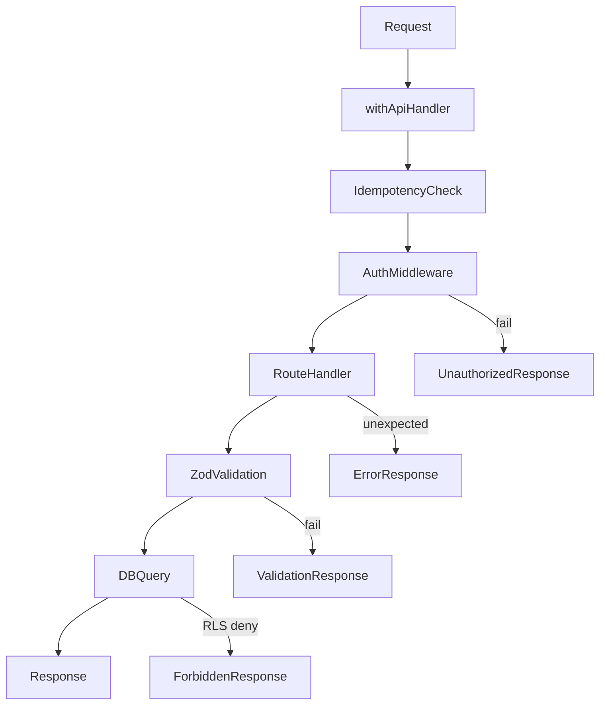

# Backend Infrastructure — Bunkai TMS

> Generated: 2026-05-25

## Stack

| Layer | Technology | Version | Purpose |
|-------|------------|---------|---------|
| Runtime | Bun | ^1.3 | JS runtime + package manager |
| Framework | Next.js (App Router) | 15.x | SSR, API routes, server actions |
| Language | TypeScript | ^5.9 | Typed JavaScript |
| Database | Supabase PostgreSQL | Latest | Primary data store |
| Auth | Supabase Auth | Latest | Magic-link OTP, sessions |
| Validation | Zod | 4.x | Schema validation |
| OpenAPI | `openapi/openapi` + Scalar | Auto | API spec docs |

## Database

### Supabase Migrations

| File | Purpose | Tables Affected |
|------|---------|-----------------|
| `0001_tenancy.sql` | Workspace + member RLS | `workspaces`, `workspace_members` |
| `0002_projects.sql` | Project scoping | `projects` |
| `0003_modules.sql` | Hierarchical module tree + user stories + ACs | `modules`, `user_stories`, `acceptance_criteria` |
| `0004_atcs.sql` | ATC core + FTS | `atcs`, `atc_steps`, `atc_assertions`, `atc_acceptance_criteria`, GIN index on tsv |
| `0005_rls_helpers.sql` | RLS policy functions | Helper functions |
| `0006_bootstrap_workspace.sql` | Onboarding RPC | `bunkai_bootstrap_workspace()` |
| `0007_save_atc.sql` | ATC upsert RPC | `bunkai_save_atc()` |
| `0008_access_tokens.sql` | PAT tokens + RLS | `access_tokens` |

### Key RPC Functions

| Function | Params | Purpose |
|----------|--------|---------|
| `get_user_workspace_ids()` | — | Return workspace IDs where user is member |
| `get_user_workspace_role(p_workspace_id)` | workspace_id | Return role for current user |
| `bunkai_bootstrap_workspace(p_slug, p_name)` | slug, name | Create workspace + owner membership |
| `bunkai_save_atc(p_atc_id, p_project_id, p_module_id, p_user_story_id, p_slug, p_title, p_layer, p_tags, p_steps, p_assertions, p_ac_ids)` | All | Upsert ATC + steps + assertions + links |

### RLS Strategy

```
Row → get_user_workspace_ids() contains workspace_id
  ↓
Role check via get_user_workspace_role()
  ↓
Role-specific: SELECT / INSERT / UPDATE / DELETE
```

| Table | RLS Policy | Effect |
|-------|-----------|--------|
| workspaces | SELECT/UPDATE/DELETE: workspace_id in get_user_workspace_ids() | Members can see workspace |
| workspace_members | SELECT: same workspace, INSERT: admin, DELETE: owner | Admin mgmt |
| projects | workspace_id in get_user_workspace_ids() | Members see projects |
| modules | project_id → workspace check (helper) | Members see modules |
| user_stories | module_id → project → workspace check | Members see stories |
| acceptance_criteria | user_story_id → module → project → workspace | Members see ACs |
| atcs | project_id → workspace check | Members see ATCs |
| access_tokens | user_id = auth.uid() AND workspace check | Users see own tokens |

## API Layer

### Route Handler Pattern

Every API route uses `withApiHandler` wrapper:

```typescript
export const GET = withApiHandler(async (request, { params }) => {
  // handler logic
  return NextResponse.json({ data });
});
```

The wrapper provides:
- Structured error handling (catch Zod/RLS/unknown errors)
- Request ID propagation (`x-request-id`)
- JSON structured logging
- Idempotency key support (POST/PUT)

### Auth Middleware

**Session auth** (`lib/supabase/server.ts`):
- Cookie-based via `@supabase/ssr` `createServerClient`
- Used by Next.js server components and route handlers
- Session refreshed on each request

**PAT auth** (`lib/api/middleware/bearer.ts`):
- Extracts `bk_pat_<prefix>.<secret>` from Authorization header
- Looks up token by prefix (O(1) via B-tree index)
- Constant-time hash comparison
- Checks revoked_at + expires_at
- Sets user context from token

### Error Flow



## Deployment

### Vercel

| Aspect | Detail |
|--------|--------|
| Provider | Vercel (assumed from Next.js community standard) |
| Config | `next.config.ts` — minimal: `reactStrictMode`, `typedRoutes`, `images` |
| Environment | `.env.local` → Vercel env vars (likely configured in dashboard) |
| Build | `next build` (standard) |
| Preview | Vercel preview deploys per PR branch |
| Domains | Unknown (no vercel.json in repo) |

Email delivery via Resend, configured in Supabase Auth SMTP settings.

### CI/CD

**Pre-commit (Husky):**
1. lint-staged: ESLint on `*.{ts,tsx,js,jsx}`, Prettier on `*.{json,yml,yaml,css,scss,html}`
2. TypeScript check (`tsc --noEmit`)
3. Env variable lint (`bun run vars:check`)

**No GitHub Actions pipeline detected.** Deployment is likely triggered by Vercel GitHub integration (auto-deploy on push to main/staging).

## External Dependencies

| Package | Version | Purpose |
|---------|---------|---------|
| `next` | ^15.x | Framework |
| `react` | ^19.x | UI library |
| `@supabase/supabase-js` | Latest | Supabase client |
| `@supabase/ssr` | Latest | SSR auth helpers |
| `zod` | ^4.0.0-alpha.* | Schema validation |
| `tailwindcss` | ^4.x | CSS framework |
| `@tailwindcss/postcss` | Latest | PostCSS plugin |
| `@monaco-editor/react` | Latest | Code editor |
| `openapi/openapi` | Auto | OpenAPI spec generation |
| `@scalar/nextjs-openapi` | Latest | API docs UI |
| `lucide-react` | Latest | Icons |
| `sonner` | Latest | Toast notifications |

Packages are managed by `bun.lock` — install with `bun install`.

## Environment Variables

| Variable | Required | Purpose | Source |
|----------|----------|---------|--------|
| `NEXT_PUBLIC_SUPABASE_URL` | ✅ | Supabase project URL | `.env.local` |
| `NEXT_PUBLIC_SUPABASE_ANON_KEY` | ✅ | Public API client key | `.env.local` |
| `SUPABASE_SERVICE_ROLE_KEY` | ✅ | Admin database access | `.env.local` |
| `DATABASE_URL` | ✅ | Direct DB connection | `.env.local` |
| `RESEND_API_KEY` | ✅ | Email delivery | `.env.local` |

Additional env vars likely exist for Jira scripts (ATLASSIAN_*).

## Tests

**No automated tests exist.** The QA boilerplate is in this repo (`bunkai-qa-engineering-jesusdev`) — the TMS repo (`../upex-bunkai-tms`) has no test directory or test files.

See `.context/risk-assessment.md` for documented risk.
